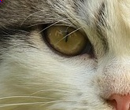
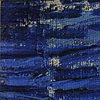

# Decision Tree Regressor 🌳 x Lossy Compression Algorithm 🧳

This is an attempt at making a **Decision Tree Regressor** into a **Lossy Compression Algorithm for images**. The plan was to train the regressor on the target image and save a file with the model memory, which is theoretically smaller to store than the target image. Then, to retrive the data, the model would predict the color of a pixel based on its position.

## Cat

Before

After

### Stats
- Aproximate theoretical reduction: 42.5%.
- Execution Time: 0,406s

###

[original picture](https://pixabay.com/pt/photos/gato-gatinho-bicho-de-estima%C3%A7%C3%A3o-9125207/).
## A 128 x 128 chunk of 'The Starry Night'

Before

After

### Stats
- Aproximate theoretical reduction: 64.5%.
- Execution Time: 0,467s
